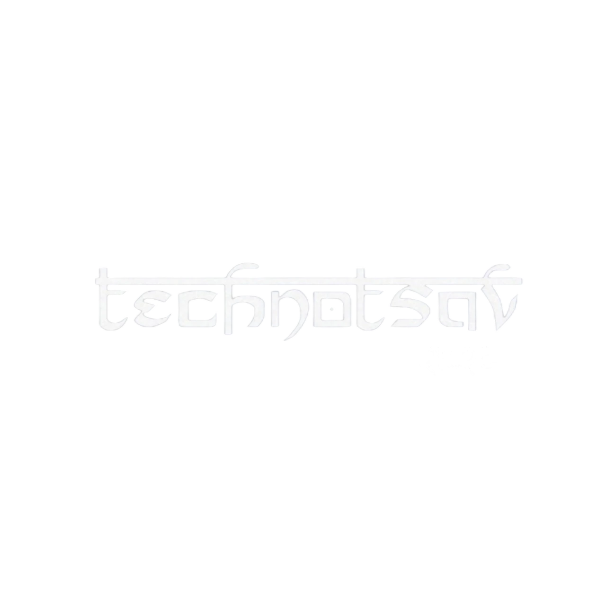

<div align="center">



# 🎓 Technotsav 2026 — CIT ETC Fest

**The Official Website of Technotsav — Annual Technical & Cultural Fest**  
*Chennai Institute of Technology · Electronics & Telecommunication Department*

[](https://techno-web-seven.vercel.app/)
[](https://github.com/sushant23-git/Technotsav-ETC-2k26/stargazers)
[](https://github.com/sushant23-git)

</div>

---

## ✨ About the Project

**Technotsav** is the flagship annual fest of the **Electronics & Telecommunication Department (ETC)** at **Chennai Institute of Technology**. This repository contains the complete source code for the official Technotsav 2026 website — a blazing-fast, fully static web experience built without any modern frontend framework.

> *"This isn't just code — it's craftsmanship."* — Sushant Gajbhiye

The website features **60+ events** across Technical, Non-Technical, Workshops, Sports, and Pro Show categories — all dynamically loaded from a single JSON data file.

---

## 🚀 Features

### 🎨 Visual & UX
- 🌑 **Dark Glassmorphism UI** — Sleek acrylic/frosted glass design with noise texture overlay
- 🖱️ **Custom Animated Cursor** — Interactive cursor with hover effects and parallax
- 🎬 **Background Video Hero** — Cinematic video in the landing section
- 🌀 **Smooth Scrolling** — Custom `butter.js` damper-based scroll engine
- ✨ **Scroll Animations** — Elements fly in with IntersectionObserver
- 📱 **Fully Responsive** — Mobile-first design across all screen sizes

### ⚙️ Technical
- ⚡ **Zero Dependencies Framework** — Pure Vanilla HTML, CSS, JavaScript
- 🗂️ **JSON-Driven Events** — All 60+ events loaded dynamically from `events.json`
- 🔍 **Event Filtering** — Filter by category in real time
- 📲 **PWA Enabled** — Installable on mobile/desktop, works offline
- 🔐 **Google OAuth** — Login via Google with session management
- 📈 **Google Analytics** — Real-time visitor tracking
- 🗺️ **SEO Optimized** — Open Graph, Twitter Cards, Sitemap, meta tags

### 🎉 Events Coverage
| Category | Description |
|---|---|
| 🔩 **Technical** | Drone Racing, Embedded Systems, CAD Design, and more |
| 🎭 **Non-Technical** | Dance, Music, Drama, Quiz, Photography, and more |
| 🛠️ **Workshops** | Blockchain, Cinematography, Robotics, and more |
| ⚽ **Sports** | Chess, Futsal, Cricket, and more |
| 🎵 **Pro Shows** | DJ Night, Musical Night, Special Performances |

---

## 🛠️ Tech Stack

| Layer | Technology |
|---|---|
| **Markup** | HTML5 |
| **Styling** | CSS3 (3000+ lines, custom animations) |
| **Logic** | Vanilla JavaScript (ES6+) |
| **DOM Helper** | jQuery 3.x |
| **Icons** | Font Awesome 4.7 |
| **Fonts** | Jura, Montserrat, Prakrta (Custom) |
| **Analytics** | Google Analytics (gtag.js) |
| **PWA** | Service Worker + Web App Manifest |
| **Deployment** | Vercel |

---

## 📁 Project Structure

```
Technotsav-2026/
│
├── 📄 index.html              # Main landing page (hero, events, about, sponsors)
├── 📄 events.html             # Full event listings with filter
├── 📄 404.html                # Custom 404 error page
├── 📄 credits.html            # Credits & acknowledgments
│
├── 🎨 style.css               # Main stylesheet (3000+ lines)
├── ⚙️  script.js               # Core application logic
├── 🖱️  cursor.js               # Custom cursor & parallax effects
├── 🌀 butter.js               # Smooth scroll engine
│
├── 📦 js/
│   └── jquery.min.js          # jQuery library
├── 📦 css/
│   └── font-awesome.min.css   # Icon library
│
├── 📊 events.json             # All event data (60+ events)
├── 📋 manifest.json           # PWA manifest
├── 🗺️  sitemap.xml             # SEO sitemap
├── ⚙️  service-worker.js       # PWA caching layer
│
├── 🖼️  bgs/                    # Event thumbnail images (75 WebP files)
├── 🖼️  image/                  # Open Graph & general images
│
├── 🔤 Jura-VariableFont_wght.woff2
├── 🔤 Montserrat-Medium.woff2
└── 🔤 prakrta_.woff2
```

---

## 🏃 Getting Started

### Prerequisites
- A modern web browser (Chrome, Firefox, Edge, Safari)
- A local HTTP server (optional, but recommended for PWA features)

### Run Locally

```bash
# 1. Clone the repository
git clone https://github.com/sushant23-git/Technotsav-ETC-2k26.git
cd Technotsav-ETC-2k26

# 2. Open directly in browser
# Simply open index.html — OR use a live server for full PWA support

# Using Python (if installed)
python -m http.server 8000

# Using Node.js
npx serve .
```

Then visit `http://localhost:8000` in your browser.

### Customization

| What to Change | Edit This File |
|---|---|
| Events data | `events.json` |
| Visual styles | `style.css` |
| Core logic | `script.js` |
| SEO / Meta tags | `index.html` `<head>` section |
| PWA config | `manifest.json` |
| Event images | `bgs/` directory |

---

## 🎨 Design Philosophy

- **No Framework, No Bloat** — Zero build step. Just open and go.
- **JSPA Architecture** — Custom JavaScript Page Architecture for dynamic routing without full page reloads.
- **Dark-First Design** — Primary background `#131313` with acrylic blur layers.
- **Handcrafted Animations** — Every animation is custom-coded with CSS keyframes and JS.

---

## 📸 Screenshots

> The website features a stunning dark glassmorphism design with animated elements, a custom cursor, and seamless event browsing.

---

## 👨‍💻 Developer

<div align="center">

**Sushant Gajbhiye**  
Full Stack Developer ·

[](https://github.com/sushant23-git)

</div>

---

## 📄 License

This project is open-source and available for educational and non-commercial reference.  
Please give proper credit if you use any part of this design or code.

---

<div align="center">

Made with ❤️ for **Technotsav 2026**  


</div>
